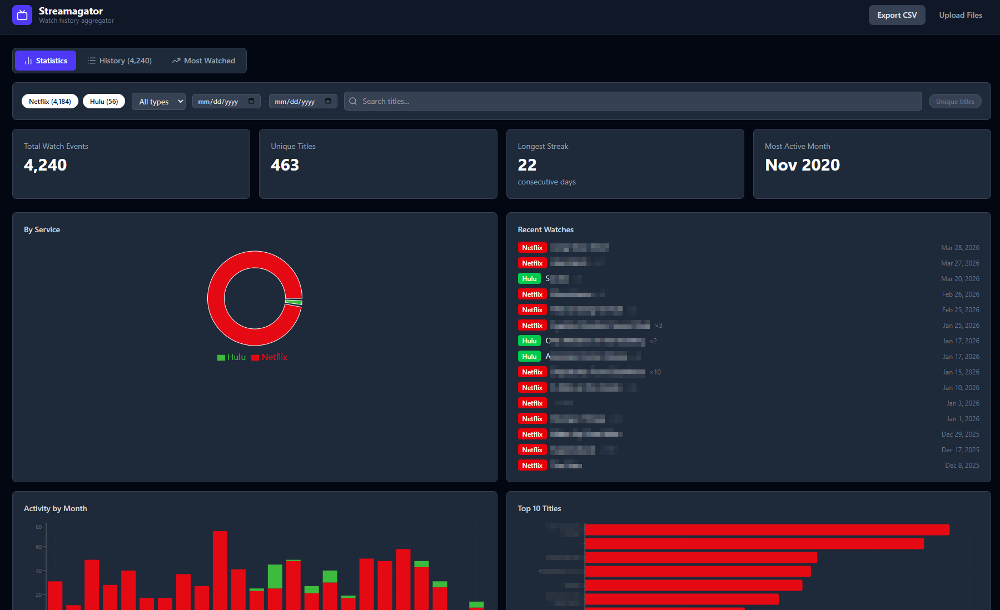

# Streamagator

Aggregate and explore your streaming watch history from Netflix, Amazon Prime Video, and Hulu — all in the browser. No account required, no data ever leaves your device.



## Features

- **Multi-service support** — import from Netflix (CSV), Prime Video (CSV), and Hulu (CSV or PDF data export)
- **Statistics dashboard** — total watches, unique titles, longest streak, most active month, activity by month, top titles, and recent watches
- **Most Watched tab** — series with 8+ unique episodes, with rewatch counts and season breakdown
- **History tab** — full paginated watch history with filtering and a "unique titles" toggle
- **Filters** — by service, content type (movie/episode), date range, and text search
- **Export** — download your merged, normalized history as a single CSV
- **Privacy first** — everything runs locally; no server, no tracking

## Getting started

```bash
npm install
npm run dev
```

Open [http://localhost:5173](http://localhost:5173).

## How to export your data

**Netflix**
1. Go to [netflix.com/viewingactivity](https://www.netflix.com/viewingactivity)
2. Scroll to the bottom and click **Download all**
3. Upload `NetflixViewingHistory.csv`

**Amazon Prime Video**
1. Go to [amazon.com/hz/privacy-central/data-requests/preview.html](https://www.amazon.com/hz/privacy-central/data-requests/preview.html)
2. Click **Request My Data** and select **Prime Video Watch History**
3. Download the ZIP when ready and upload the Prime Video CSV

**Hulu**
1. Go to [hulu.com/account/privacy](https://www.hulu.com/account/privacy)
2. Click **Download My Information** and select **Watch History**
3. Upload either the PDF or CSV from the download

## Tech stack

- [React 19](https://react.dev) + [Vite](https://vite.dev) + TypeScript
- [Tailwind CSS v4](https://tailwindcss.com)
- [Recharts](https://recharts.org) for charts
- [PapaParse](https://www.papaparse.com) for CSV parsing
- [pdfjs-dist](https://github.com/mozilla/pdf.js) for Hulu PDF parsing
- [date-fns](https://date-fns.org) for date handling
